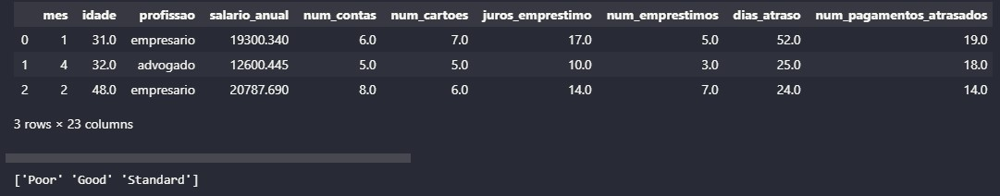
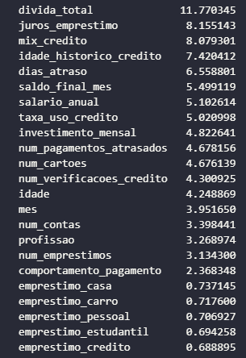

# Inteligência Artificial
## Predição de score de crédito
Este projeto consiste na solução para score de credito de novos clientes de banco. Analisando o perfil do novo cliente é possivel definir um score Bom, Ok ou Ruim.

## Treinamento
Treina os modelos de IA com os dados dos clientes já existentes.

## Inferência
Com os modelos treinados, são passados os dados de entrada dos novos clientes para realizar a predição do score de crédito.

Além de prever o score de novos clientes, o modelo de IA nos mostra as variaveis que mais impactam no score de crédito.

Visualizamos as variaveis mais impactantes, ordenadas de acordo com o feature_importance.